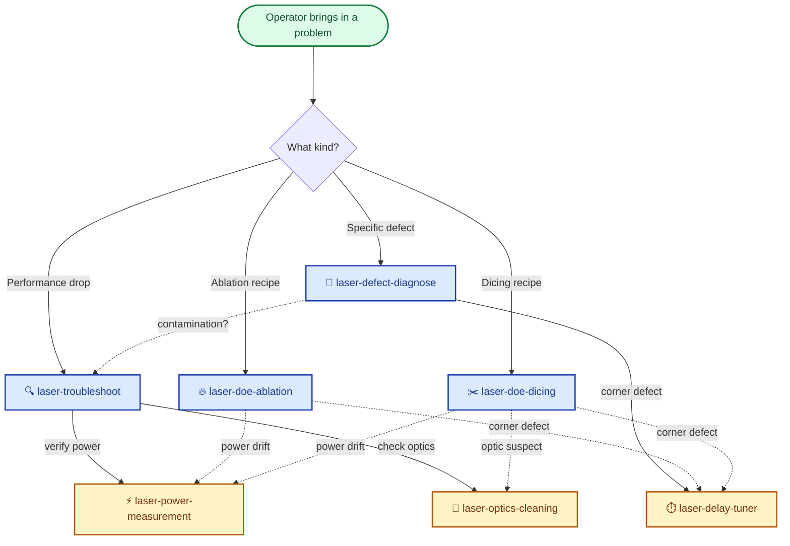

# 🔬 Industrial Laser Principles

> **Step-gated, reference-grounded Claude skills for laser process engineering.**
> Seven specialists, ten reference docs, one rulebook. Built for operators and engineers who need each step verified — not autonomous batch execution.


---

## 🗺️ How the Seven Skills Compose



**Solid arrows** = primary hand-offs.
**Dashed arrows** = conditional mid-run hand-offs (e.g. a DOE skill notices a corner defect during validation and hands off to the delay-tuner without abandoning the recipe work).

---

## 🎯 What This Is

Industrial laser systems are unforgiving. A wrong fluence scratches a wafer. A skipped power-meter step lets a drift go undetected for days. A clean-the-lens routine done wrong destroys a four-figure optic.

**Industrial Laser Principles** is a Claude skill package built for that environment. It contains:

- **7 step-by-step interactive skills** — every workflow pauses for operator confirmation at every gate
- **10 reference documents** — Gaussian beam physics, ablation, dicing, welding, optics, scanners, and operational SOPs
- **One shared rulebook** — every skill must ground its answers in the references and cite specific sections

These skills are written for the way real lab and production work actually happens: **one verified step at a time, with the operator deciding when to advance**. Not "let the AI run end-to-end" — **"let Claude be the careful colleague who checks every step before you do it."**

### Who this is for

Industrial laser process engineers across **semiconductor wafer dicing, medical device marking, aerospace ablation, PCB drilling, electronics packaging, and precision micromachining**. The skills and references are domain-agnostic — they cover the general physics of laser-material interaction, beam optics, scanner systems, and DOE methodology. They do not encode any specific company's recipes, customer applications, or proprietary process knowledge.

If you're a process engineer dealing with recurring DOE work for laser ablation, dicing, welding, or scribing — across any of the application areas above — these skills compress the recipe-development cycle by enforcing a step-gated workflow grounded in canonical references.

---

## 🧭 Why This Is Different

| Generic AI prompts | Industrial Laser Principles |
|---|---|
| "Act as a laser expert" | 7 specialized skills with defined workflows |
| Answers blended from training data | Answers cited to specific reference sections |
| Runs to completion autonomously | Pauses at every step for operator confirmation |
| Defaults assumed silently | Asks every parameter explicitly, even reasonable-sounding ones |
| External knowledge mixed in invisibly | Reference-only on covered topics; external content **must** be flagged |
| One-size-fits-all calculation | Different DOE workflows for ablation vs. dicing vs. welding because the physics differ |

The whole point is to be **wrong less often, in places that matter**.

---

## ⚡ Quick Start

### Use with Claude Code (recommended)

**Option 1 — Install as a plugin (one command, all 7 skills + references included):**

```
/plugin install viczhu92/industrial-laser-principles
```

**Option 2 — Manual clone + copy:**

```bash
git clone https://github.com/viczhu92/industrial-laser-principles.git
cd industrial-laser-principles
cp -r skills/*    ~/.claude/skills/
cp -r references/ ~/.claude/references/    # if your setup loads from there
cp INSTRUCTIONS.md ~/.claude/instructions/
```

Then, in any Claude Code session, just describe what you need:

> *"Help me develop a DOE for ablating 50 µm of anodized aluminum at 1064 nm"*

Claude will pick up `laser-doe-ablation`, read the relevant references, and walk you through the **surface → depth → volume** workflow with a pause at each step.

> **Note:** The plugin install path requires Claude Code (CLI). Claude Desktop and Claude.ai (web) do not support plugins — they have their own per-skill upload mechanism. A separate Claude.ai-ready zip distribution is on the roadmap.

### Use as a reference library (no agent required)

Even without invoking the skills, the reference docs are a compact, opinionated handbook. [`references/laser_ablation.md`](references/laser_ablation.md) alone is a usable text on ablation-recipe development with worked numbers and engineer's intuition callouts.

---

## 🎭 The Specialists

Seven skills, organized by what they do.

### 🛠️ Diagnostic & Troubleshooting

| Skill | What it does | When to call |
|---|---|---|
| 🔍 [**laser-troubleshoot**](skills/laser-troubleshoot/SKILL.md) | Enforces the **correct triage order** so alignment isn't blamed for a power, optics, or focus problem | *"Cut quality dropped this morning. Where do I start?"* |
| 🐛 [**laser-defect-diagnose**](skills/laser-defect-diagnose/SKILL.md) | Classifies a specific defect (recast lip, charred edge, taper, HAZ darkening) into root cause + corrective action | *"I'm seeing a burn-in dot at every line start"* |
| ⏱️ [**laser-delay-tuner**](skills/laser-delay-tuner/SKILL.md) | Maps corner / line-end symptoms to the offending scan delay; suggests step size anchored to 1/PRF | *"The four corners of my square don't close — which delay do I touch?"* |

### 🧪 Recipe Development (DOE)

| Skill | What it does | When to call |
|---|---|---|
| 🔥 [**laser-doe-ablation**](skills/laser-doe-ablation/SKILL.md) | Three-stage DOE: **single-shot threshold (Liu plot) → log-spaced Power × Speed line matrix → hatched / multi-pass area** with thermal-accumulation diagnostic | *"I need a marking recipe for anodized Al at 50 kHz — where do I start?"* |
| ✂️ [**laser-doe-dicing**](skills/laser-doe-dicing/SKILL.md) | Path decision (stealth / ablative / fusion) → geometric feasibility check → polarization choice → multi-pass matrix | *"Help me dice 100 µm Si at 50,000 dies/hour"* |

### 📋 Operational SOPs

| Skill | What it does | When to call |
|---|---|---|
| ⚡ [**laser-power-measurement**](skills/laser-power-measurement/SKILL.md) | Walks the 7-step power-meter routine with PPE confirmation, beam-size enforcement, wavelength-correction check, and ±0.5% repeatability sanity-check | *"I need to verify laser output before today's run"* |
| 🧼 [**laser-optics-cleaning**](skills/laser-optics-cleaning/SKILL.md) | Inspect first, only escalate cleaning if needed; enforces solvent freshness and the "one stroke, one tissue" rule | *"F-θ has smoke residue, walk me through cleaning it"* |

> **Each skill cross-references the others.** When `laser-troubleshoot` reaches its Step 1 (verify power), it hands the operator to `laser-power-measurement`. When `laser-doe-dicing` flags a corner defect during validation, it hands to `laser-delay-tuner`. The skills compose.

---

## 📚 The Reference Library

| Document | What's inside |
|---|---|
| 📐 [`gaussian_beam_theory.md`](references/gaussian_beam_theory.md) | Beam physics, M², spot size, Rayleigh range, divergence, **9 common conceptual traps** with corrections |
| 🧮 [`laser_process_calculations.md`](references/laser_process_calculations.md) | Worked formulas: fluence, peak power, peak intensity, focal spot — with material-regime sanity tables (photothermal / photoablation / plasma) |
| ⚡ [`measuring-laser-power.md`](references/measuring-laser-power.md) | The 7-step power-measurement procedure with caveats (warm-up times, F-θ damage risk, wavelength correction) |
| 💎 [`laser_optics_selection.md`](references/laser_optics_selection.md) | Substrate choice (BK7 vs. fused silica thermal lensing math), AR/HR coatings, scratch-dig grades by application, damage-threshold sizing with **√τ pulse-width scaling** |
| 🧼 [`laser_optics_cleaning.md`](references/laser_optics_cleaning.md) | Particle vs. film contamination, four-level escalating cleaning protocol, solvent freshness schedule by container type |
| 🎯 [`scanner_alignment.md`](references/scanner_alignment.md) | 4 alignment DOFs (`dX`, `dY`, `Yaw`, `Pitch`), two-target principle, 5 beam-visualization tools, beam-expander alignment, Trumpf vs. scanner-aperture tolerance gap as worked example |
| 🎛️ [`scanner_optimization.md`](references/scanner_optimization.md) | Focal-plane finding (3 ladder methods), field calibration, rise-time (5–500 µs / ms-to-s), 7-row scan-delay symptom table |
| 🔥 [`laser_welding.md`](references/laser_welding.md) | Conduction (~0.5 MW/cm²) / Transition (~1 MW/cm²) / Keyhole (>1.5 MW/cm²) modes — and how to drive them |
| 🌬️ [`laser_ablation.md`](references/laser_ablation.md) | Ablation physics + the **3-stage DOE workflow** that drives `laser-doe-ablation`. Includes pulse-width / cold-vs-warm tradeoff and HAZ definition pitfall |
| ✂️ [`laser_dicing.md`](references/laser_dicing.md) | Stealth dicing for transparent materials, ablative cutting wall-angle math, polarization (linear → circular), dissimilar-material recipe compromises |

> **These references are written to be read end-to-end in one sitting.** They're not API docs. Each section ends with an **"Engineer's intuition"** callout — the takeaway that matters when you're at the bench and short on time.

---

## 💼 Real-World Scenarios

### Scenario 1 — New laser installed, recipe shifted

You swapped the laser yesterday. Today the cut depth is 30% lower at the same recipe.

**Workflow:**

```
🔍 laser-troubleshoot     → Triage in the correct order:
   Step 1: ⚡ laser-power-measurement   (is the source actually delivering spec?)
   Step 2: 🧼 laser-optics-cleaning    (any optic gone hazy in the last 24h?)
   Step 3: focal-plane parallelism check
   Step 4: alignment — only if 1–3 are clean
```

**Why this matters:** without the enforced order, half the time you tear apart the alignment and never check that the new laser is just out of spec. Skill enforces correct sequencing.

### Scenario 2 — Developing a process for a new material

You need to mark a new substrate. No literature value for the ablation threshold. Operations wants the recipe by Friday.

**Workflow:**

```
🔥 laser-doe-ablation
   ├─ Stage 1: SURFACE  — non-overlapping single-shot fluence sweep
   │           → Liu plot from crater diameters
   │           → ablation threshold value
   │
   ├─ Stage 2: DEPTH   — log-spaced Power × Speed line matrix (1.6× steps)
   │           → operator picks the best-quality cell at fastest speed
   │
   └─ Stage 3: VOLUME  — hatched lines + multi-pass repeats
               → linear vs. nonlinear (repeats × 1/speed) diagnostic
               → if nonlinear: add Pause between passes, or drop power
```

**Why this matters:** structured threshold determination + log-spaced sweeps means **fewer dud cells**, and the diagnostic at the end catches thermal accumulation that would otherwise quietly fail the recipe at production scale on a 200 mm panel.

### Scenario 3 — Cut quality complaint at production line

Operator reports "marks aren't right." You don't know if it's process, alignment, contamination, or scan-delay drift.

**Workflow:**

```
🐛 laser-defect-diagnose  → Localize the defect first:
   ├─ Position-specific (corners, line ends)? → ⏱️ laser-delay-tuner
   ├─ Distributed across the cut?              → ablation/dicing root-cause table
   ├─ Surface only, away from cuts?            → 🔍 laser-troubleshoot
   └─ Random / intermittent?                   → 🔍 laser-troubleshoot
```

**Why this matters:** the same word ("burn") means different things in different places on the part. Localizing first prevents the wrong skill from being invoked.

---

## 🛡️ How It Stays Honest

The package's [`INSTRUCTIONS.md`](INSTRUCTIONS.md) enforces three rules every skill must follow:

### 1. Reference-first

Search [`references/`](references/) before answering anything. The references contain the canonical knowledge for this package — that's where the answer should come from.

### 2. Reference-only on covered topics

If a topic is covered in the references, **the answer uses only the references.** External knowledge is allowed only when:
- The topic is genuinely **not in the references at all**, AND
- The added content is **clearly labeled** as "outside the reference docs."

This means the operator never gets a confidently-stated answer that turns out to be Claude's training-data hallucination.

### 3. Step-gated execution

- Pause at every step.
- Confirm parameters before computing.
- Show interim results before applying them.
- Wait for go / no-go at every branch.
- Honor "stop" / "wait" / "let me check" — don't volunteer the next step.

### Citations are mandatory

Every technical claim points back to a specific section of a specific reference doc:

> *"Per `laser_ablation.md §12`, a 1.6× log-spaced Power × Speed matrix covers the relevant range without wasting test cells."*

The operator can verify any recommendation before acting on it. **No ungrounded claims.**

---

## 🚧 Status

This is a **new** package and has not yet been validated against many real production scenarios. **Iteration based on operator feedback is expected and welcome.**

### ✅ Built and ready to use

- 7 SKILL.md workflows
- 10 reference documents
- Shared rules (INSTRUCTIONS.md)
- Cross-skill hand-offs

### 🚧 Planned but not built yet

- `lib/log_matrix.py` — generate the 1.6× DOE matrix as CSV / xlsx
- `lib/laser_calc.py` — focal-spot / fluence / intensity / damage-threshold helper
- `lib/ppc_writer.py` — Excel writer matching common process-parameter calculator layouts
- `laser-doe-welding` — welding DOE skill (the welding reference doc has the framework but not yet a step-by-step DOE workflow)
- `laser-damage-sizer` — pre-flight check for whether an optic survives a given laser configuration
- An installer script for one-command setup across multiple agentic-coding tools

---

## 🤝 Contributing

Issues, PRs, and feedback are all welcome.

### Two requests when contributing

1. **Don't add company-specific content.** The reference docs are intentionally general — substrate types, generic vendor models for examples (Trumpf, IPG, Lumentum, etc.), but no proprietary recipes or single-employer-specific workflows.

2. **Cite when adding to references.** New technical claims should include a source (textbook, vendor datasheet, peer-reviewed paper) so the next contributor can verify, and so that skills citing the reference can stay accurate.

### Good first contributions

- 📝 Fix a typo or clarify a confusing sentence in a reference doc
- 🐛 File an issue when a skill misses a real production scenario
- 🧪 Add a real-world scenario to a SKILL.md's cross-references
- 🔧 Build one of the planned `lib/` scripts
- 🌍 Translate a reference doc to another language
- ✨ Propose a new skill — open an issue describing the scenario it would handle

---

## 🎓 Design Philosophy

Three principles guided how every skill is shaped:

**1. The operator owns the loop, not the AI.**
The skill is a careful colleague that verifies each step. The operator decides when to advance. This is non-negotiable for a skill that touches expensive hardware and finished work.

**2. Honest sourcing beats confident answers.**
Better to say *"the reference docs don't cover this directly"* than to dress up a guess. Every claim has a citation. Every absence of a citation is a flag.

**3. Different physics, different workflows.**
Ablation, dicing, and welding share some math but diverge fast. Forcing them into one DOE skill produces flabby workflows that aren't great at any of them. They're separate skills for a reason.

---

## 📜 License

[MIT](LICENSE) — use freely in commercial and non-commercial settings. Attribution appreciated but not required.

---

## 👤 About the Author

Built by **[Victor Zhu](https://github.com/viczhu92)** — manufacturing process engineer focused on industrial laser applications across electronics, semiconductor, and precision manufacturing. Connect on [LinkedIn](https://www.linkedin.com/in/victorzhu1/).

## 🙏 Acknowledgments

Built with [Claude Code](https://docs.claude.com/claude-code).

---

**Found a real bug, gap, or scenario this should handle? [Open an issue](https://github.com/viczhu92/industrial-laser-principles/issues).**
**Used it in a real recipe? Tell us — feedback is how this gets better.**

⭐ Star this repo if it's useful • 🍴 Fork it • 🐛 Report an issue
